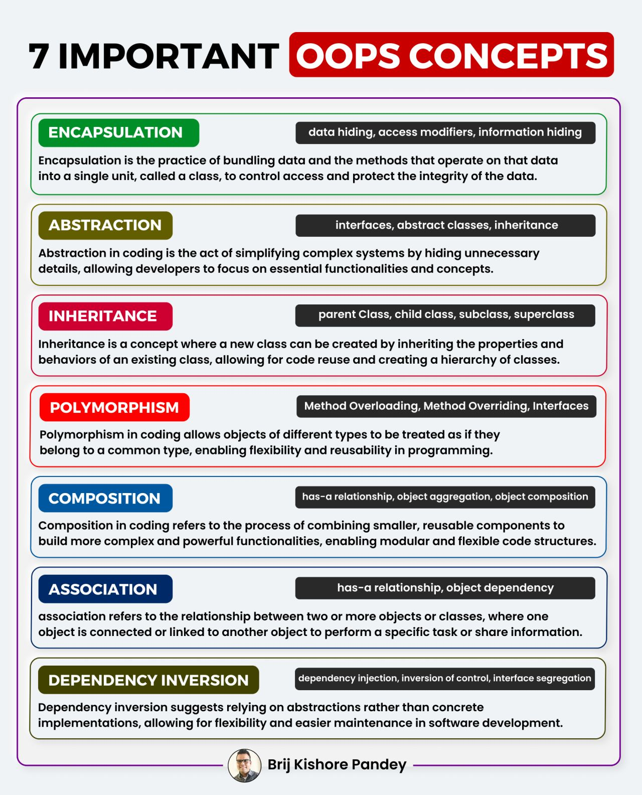

OOP ==> Herencia
---
[CLASE 30](https://drive.google.com/file/d/1XLl-wXV7c0I1CmBBF9zuOM3cO6uKX3ne/view?usp=sharing)

Que propiedades tienen los objetos. Conceptos básicos e importantes en OOPs

- Encapsulamiento
- Abstraccion
- Herencia
- Polimorfismo

---
* Metodos de acceso
 
- [POLIMORFISMO](https://pythones.net/polimorfismo-sobrecarga-metodos/)

* Que es la herencia simple y herencia multiple?
    - [HERENCIA SIMPLE Y MULTIPLE](https://unipython.com/herencia-multiple-de-clases-en-python/)
    
* Que es la colaboracione entre clases?
    - [DATA EXTRA](https://www.seas.es/blog/informatica/agregacion-vs-composicion-en-diagramas-de-clases-uml/)

    - Composición ? -> Como componer una clase => persona necesita brazos y piernas
    - Agregacion ? --> Una persona necesita tener pantalon? No pero se los decoras
    - Asociación ? --> La persona, necesita necesariamente tarjetas de credito o un auto?, no pero se les puede asociar.
    

Bibliofia extra:
> [OOPS](https://picodotdev.github.io/blog-bitix/2021/03/los-conceptos-de-encapsulacion-herencia-polimorfismo-y-composicion-de-la-programacion-orientada-a-objetos/)

> [DEPENDECY INJECTION](https://pywombat.com/articles/dependency-injection-python)